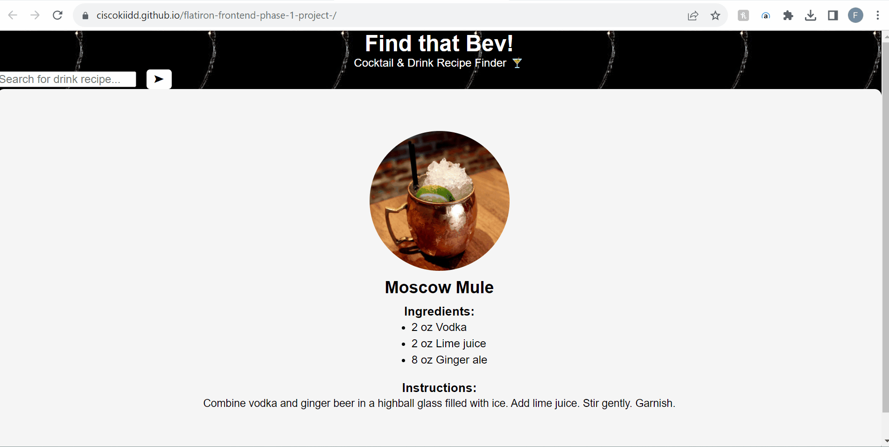

# flatiron-frontend-phase-1-project-

My Flatiron phase 1 project is "Find that Bev!", a cocktail and drink recipe finder.

## Installation

To start, you will click the link https://ciscokiidd.github.io/flatiron-frontend-phase-1-project- !

## Usage

## Contributing

Not seeking any contributions at this time, thank you.

## License

[MIT](https://choosealicense.com/licenses/mit/)
